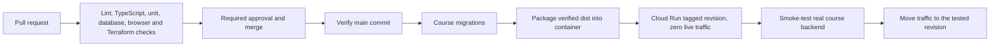

# Matjakt

React/TypeScript grocery price comparison application with Supabase Auth/Postgres. The DevOps course frontend runs on **Cloud Run**; the existing Matjakt Firebase environment remains separate.

Course URL: https://matjakt-course-s6jsqt6gca-lz.a.run.app
Course Supabase ref: `ixrkepmiwiyqdvckqflt` (Adams Org, Micro, approximately USD 10/month in addition to the organization's plan).

The course schema was reconstructed from application contracts, then compared with a read-only export of the original database. Exported search functions and generated vectors are included in ordered migrations. See [schema provenance](docs/schema-provenance.md). Never apply the baseline to `qzpyabesygoljpohguxw` or deploy to `matjakt-27b7f`.

## Run from a clean clone

Requirements: Node **24.15.0**, npm and a running Docker engine.

```sh
npm ci
npm run db:start
npm run env:local
npm run dev
```

Supabase starts an isolated stack called `matjakt-course`, applies migrations and seeds synthetic products. API: `http://127.0.0.1:55321`; PostgreSQL: 55322. `env:local` writes only browser-safe credentials to ignored `.env.local`. No cloud credentials are needed.

```sh
npm run verify
npm audit --audit-level=high
npm run test:db
npx playwright install chromium
npm run test:e2e
npm run db:stop
```

`verify` runs lint, TypeScript, Vitest and a production build. E2E runs the built app at port 4173 against real local Supabase. OSRM and map tiles are mocked; the backend-error journey deliberately injects a failed response. To deliberately clear **local course data** and reapply migrations/fixtures: `npm run db:reset`.

## Architecture and repository

- `src/`: application, existing RPC contracts and browser Supabase client.
- `supabase/`: local config, ordered migrations, synthetic catalog and pgTAP tests.
- `tests/`: domain tests and Playwright user journeys.
- `infra/`: Terraform for Cloud Run, Artifact Registry, IAM/OIDC, GCS state and budget warnings.
- `Dockerfile.course` and `deploy/nginx.conf`: serve the already verified build with an unprivileged, digest-pinned nginx image and SPA fallback.
- `.github/workflows/ci.yml`: verification and guarded main release; actions pinned to commit SHAs.
- [Operations](docs/operations.md): bootstrap, configuration, release and recovery.
- [Evidence](docs/evidence.md): observed checks and outstanding acceptance work.
- [AI usage](docs/ai-usage.md): assistance and human review responsibilities.
- [Report source](docs/report.tex): English report draft; author names and final Actions evidence remain to be completed.

## CI/CD



PRs receive no deployment secrets. `CI gate` and one approving review are required on main. After a main push, the same commit is verified, built for the course backend and packaged once. A tagged revision receives preview tests before live traffic moves to that exact revision; live is checked again. Releases are serialized, and obsolete commits are rejected. `/version.json` records the commit and whether a manual build had uncommitted changes.

Terraform owns service configuration, registry, identity and infrastructure. CI owns container revisions and traffic; Terraform explicitly ignores those release fields. Preview/live share the course database and require backward-compatible migrations. Rollback moves traffic to a previous revision and leaves migrations in place.

## Scope and current verification

All local checks, hosted preview/live smoke tests and a no-change Terraform plan have passed. The first hosted release was an explicitly approved **manual bootstrap**, not a GitHub Actions run. Changes are not yet committed or pushed; actual PR/failing-check/release-run evidence and the second author's clean-clone verification remain outstanding.

Price collection, Kubernetes, self-hosted Supabase and a separate observability system are outside scope. Prices are fictional. See the [2026 course criteria](https://github.com/KTH/devops-course/blob/2026/grading-criteria.md#project).
