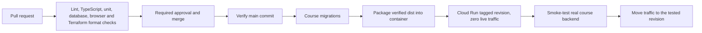

# Matjakt

React/TypeScript grocery price comparison application with Supabase Auth/Postgres. This repository builds and deploys the DevOps course frontend on **Cloud Run**. Legacy Firebase Hosting configuration is not included; the original Matjakt environment is managed separately.

Course URL: https://matjakt-course-s6jsqt6gca-lz.a.run.app
Course Supabase ref: `ixrkepmiwiyqdvckqflt` (Adams Org, Micro, approximately USD 10/month in addition to the organization's plan).

The course schema was reconstructed from application contracts, then compared with a read-only export of the original database. Exported search functions and generated vectors are included in ordered migrations. See [schema provenance](docs/schema-provenance.md). Never apply the baseline to `qzpyabesygoljpohguxw` or deploy to `matjakt-27b7f`.

## Run from a clean clone

Requirements: Node **24.15.0**, pnpm **10.34.6** and a running Docker engine. Install the pinned package manager with `npm install --global pnpm@10.34.6` if needed. The `packageManager` field pins the same version for local development and CI. pnpm 10 is used to retain documented Dependabot support; Dependabot continues to use the `npm` ecosystem setting.

```sh
pnpm install --frozen-lockfile
pnpm run db:start
pnpm run env:local
pnpm run dev
```

Supabase starts an isolated stack called `matjakt-course`, applies migrations and seeds synthetic products. API: `http://127.0.0.1:55321`; PostgreSQL: 55322. `env:local` writes only browser-safe credentials to ignored `.env.local`. No cloud credentials are needed.

```sh
pnpm run verify
pnpm audit --audit-level=high
pnpm run test:db
pnpm exec playwright install chromium
pnpm run test:e2e
pnpm run db:stop
```

Lint, type checking and both builds use the single pinned TypeScript version **6.0.3**. TypeScript 7 is excluded because `typescript-eslint` **8.71.1** requires TypeScript below 6.1.

`verify` runs lint, TypeScript, Vitest and a production build. E2E runs the built app at port 4173 against real local Supabase. OSRM and map tiles are mocked; the backend-error journey deliberately injects a failed response. To deliberately clear **local course data** and reapply migrations/fixtures: `pnpm run db:reset`.

## Architecture and repository

- `src/`: application, existing RPC contracts and browser Supabase client.
- `supabase/`: local config, ordered migrations, synthetic catalog and pgTAP tests.
- `tests/`: domain tests and Playwright user journeys.
- `infra/`: Terraform for Cloud Run, Artifact Registry, IAM/OIDC, HCP Terraform state and budget warnings.
- `Dockerfile.course` and `deploy/nginx.conf`: serve the already verified build with an unprivileged, digest-pinned nginx image and SPA fallback.
- `.github/workflows/ci.yml`: verification and guarded main release; actions pinned to commit SHAs.
- [Operations](docs/operations.md): bootstrap, configuration, release and recovery.
- [Evidence](docs/evidence.md): observed checks and outstanding acceptance work.
- [AI usage](docs/ai-usage.md): assistance and human review responsibilities.
- [Report source](docs/report.tex): English report draft; final Actions evidence and PDF layout remain to be completed.

## CI/CD



PRs receive no deployment secrets. `CI gate`, the HCP Terraform status and configured security checks are required before merging to main. After a main push, the same commit is verified, built for the course backend and packaged once. A tagged revision receives preview tests before live traffic moves to that exact revision; live is checked again. Releases are serialized, and obsolete commits are rejected. `/version.json` records the commit and whether a manual build had uncommitted changes.

Terraform owns service configuration, registry, identity and infrastructure. State is stored and locked in [HCP Terraform](https://app.terraform.io/app/einar-org/workspaces/matjakt-course); HCP runs remote speculative plans for PRs and automatically plans/applies changes under `infra` after a push to `main`, using Google OIDC. GitHub Actions checks Terraform formatting; HCP Terraform validates and plans the configuration, and its aggregated GitHub status is required before merge. CI owns container revisions and traffic; Terraform explicitly ignores those release fields. Preview/live share the course database and require backward-compatible migrations. Rollback moves traffic to a previous revision and leaves migrations in place.

## Scope and current verification

All local checks, hosted preview/live smoke tests and a no-change Terraform plan have passed. The first hosted release was an explicitly approved **manual bootstrap**, not a GitHub Actions run. Implementation is published in [PR #1](https://github.com/einhar1/matjakt/pull/1). An intentional wrong fuel-price assertion produced a failing required CI gate, then was corrected. [HCP automatic apply](https://app.terraform.io/app/einar-org/workspaces/matjakt-course/runs/run-XNzxH5XxuZUUybFU) and [Actions main release](https://github.com/einhar1/matjakt/actions/runs/37131650365) passed; preview/live version metadata matched the merge commit. The second author's independent clean-clone verification remains outstanding.

Price collection, Kubernetes, self-hosted Supabase and a separate observability system are outside scope. Prices are fictional. See the [2026 course criteria](https://github.com/KTH/devops-course/blob/2026/grading-criteria.md#project).

The hosted course backend contains a team-approved catalog snapshot from 2026-10-05; local development and CI continue to use synthetic seed data. See [snapshot verification and recovery](docs/catalog-snapshot.md).
